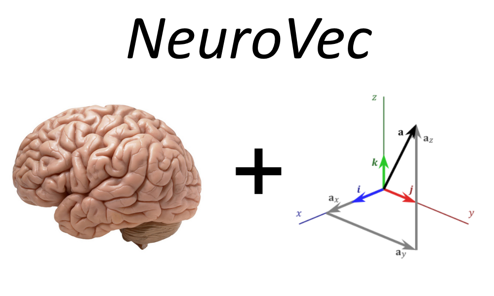
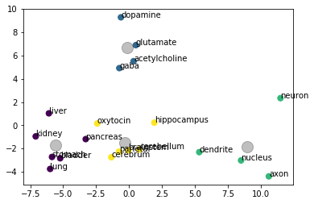

Utilizing NLP and data processing to conduct research on Word Embeddings for neuroscience

This repository utilizes NLP and Matrix Algebra to generate domain specific vector representations of words that are useful for machine learning applications. 

# Current Results:

