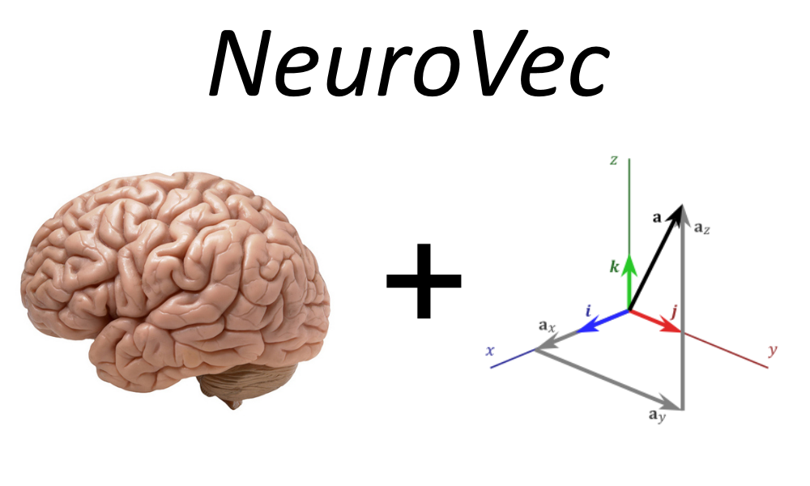
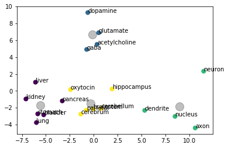
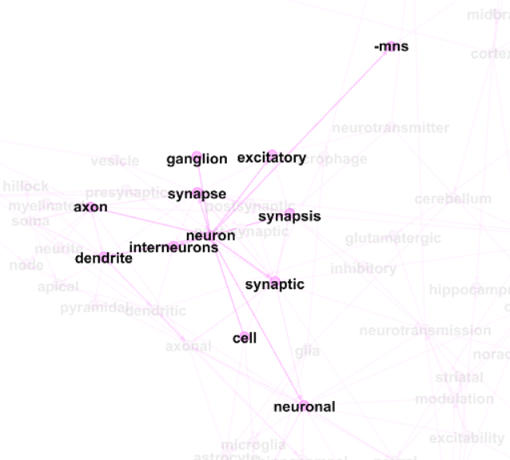
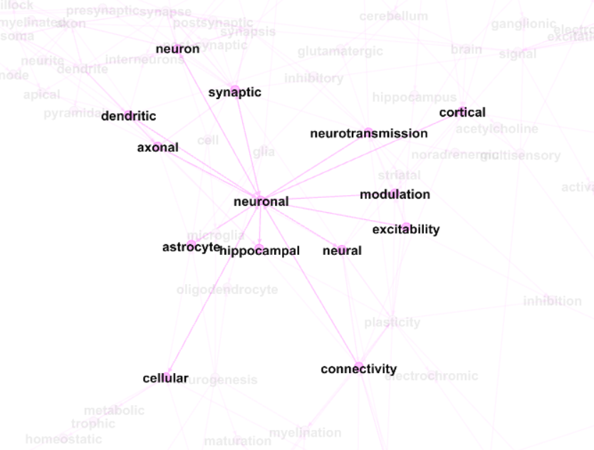
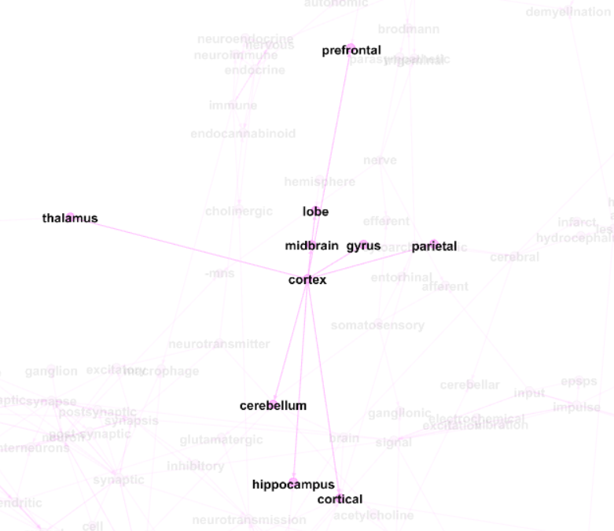

Utilizing NLP and data processing to conduct research on Word Embeddings for neuroscience

This repository utilizes NLP and Matrix Algebra to generate domain specific vector representations of words that are useful for machine learning applications. 

# Current Results:
1. Downloaded over 9000 wikipedia articles (9649 to be exact) related to Neuroscience.
2. Cleansed all articles (stop word removal, lemmatization, number and symbol removal, etc.)
3. Generated word embeddings utilizing Word2Vec
4. IN PROGRESS: Using cluster analysis and PCA to group and analyze how well the word embeddings learned the space.
5. IN PROGRESS: Currently utilizing network analysis by connecting close words in the vector space to check logical grouping
 

## PCA and Cluster Analysis
 
This PCA embedding shows 4 groups of terms projected onto a 2D plane. After running a K-means grouping algorithm you can see a clear division that the 4 disparate groups were correctly grouped.   The groups in this case were: 
neurotransmitters = ['dopamine','acetylcholine','glutamate','gaba','oxytocin'] 
partsOfNeuron = ['dendrite','axon','neuron','nucleus'] 
partsOfBody = ['lung','kidney','stomach','bladder','pancreas','liver'] 
partsOfBrain = ['cerebrum','cerebellum','brainstem','parietal','hippocampus'] 

## Network/Graph analysis
Concepts were connected based on cosine similarity. Those with a high cosine similarity were connected then Gephi was used to display and untangle the network. 
 
 
 

